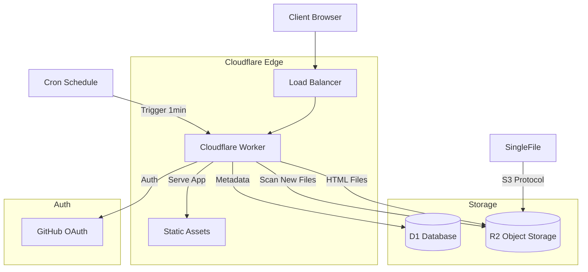

# SingleFile Share 技术设计文档 v1.0

## 1. 系统架构 (System Architecture)

采用全栈 Cloudflare 架构，前端无构建，后端使用 Worker。



## 2. 数据库设计 (Database Design)

### Schema (SQLite/D1)

```sql
-- Users Table
CREATE TABLE users (
    id INTEGER PRIMARY KEY AUTOINCREMENT,
    github_id TEXT UNIQUE NOT NULL,
    username TEXT NOT NULL,
    avatar_url TEXT,
    role TEXT DEFAULT 'user', -- 'admin' | 'user'
    status TEXT DEFAULT 'pending', -- 'pending' | 'active' | 'locked'
    storage_limit INTEGER DEFAULT 104857600, -- 100MB
    used_storage INTEGER DEFAULT 0,
    created_at DATETIME DEFAULT CURRENT_TIMESTAMP
);

-- Files Table
CREATE TABLE files (
    id INTEGER PRIMARY KEY AUTOINCREMENT,
    user_id INTEGER NOT NULL,
    filename TEXT NOT NULL,      -- 原始文件名
    display_name TEXT NOT NULL,  -- 展示名 (默认为 <title>)
    description TEXT,            -- [NEW] 文件描述
    size INTEGER NOT NULL,
    r2_key TEXT NOT NULL,        -- R2 中的存储 Key
    mime_type TEXT DEFAULT 'text/html',
    created_at DATETIME DEFAULT CURRENT_TIMESTAMP,
    updated_at DATETIME DEFAULT CURRENT_TIMESTAMP,
    FOREIGN KEY (user_id) REFERENCES users(id) ON DELETE CASCADE
);

-- Shares Table
CREATE TABLE shares (
    id INTEGER PRIMARY KEY AUTOINCREMENT,
    file_id INTEGER UNIQUE NOT NULL,
    share_id TEXT UNIQUE NOT NULL, -- UUID，对外暴露
    is_enabled BOOLEAN DEFAULT 0,
    visit_count INTEGER DEFAULT 0,
    created_at DATETIME DEFAULT CURRENT_TIMESTAMP,
    FOREIGN KEY (file_id) REFERENCES files(id) ON DELETE CASCADE
);

-- Tags Table [NEW]
CREATE TABLE tags (
    id INTEGER PRIMARY KEY AUTOINCREMENT,
    user_id INTEGER NOT NULL,
    name TEXT NOT NULL,
    created_at DATETIME DEFAULT CURRENT_TIMESTAMP,
    FOREIGN KEY (user_id) REFERENCES users(id) ON DELETE CASCADE,
    UNIQUE(user_id, name)
);

-- File Tags Junction Table [NEW]
CREATE TABLE file_tags (
    file_id INTEGER NOT NULL,
    tag_id INTEGER NOT NULL,
    created_at DATETIME DEFAULT CURRENT_TIMESTAMP,
    PRIMARY KEY (file_id, tag_id),
    FOREIGN KEY (file_id) REFERENCES files(id) ON DELETE CASCADE,
    FOREIGN KEY (tag_id) REFERENCES tags(id) ON DELETE CASCADE
);
```

## 3. 存储设计 (R2)

- **Bucket**: `singlefile-share-files`
- **Access Control**: **Private** (Public Access Disabled).
- **Key 策略**: `files/{user_id}/{filename}.html`
- **Root Key Handling**: 
    - 监控根目录上传 (e.g., `my-page.html`)。
    - 自动迁移 (Move) 至主管理员目录: `files/{admin_id}/{uuid}.html`。
    - 确保所有持久化文件均符合 `files/{user_id}/` 格式。

### Metadata Sync Flow (Cron Driven / Polling)
1. **Upload**: SingleFile -> R2 (`putObject` to root or user dir).
2. **Trigger**: Cron Schedule -> Worker (`scheduled` handler every 1 min).
3. **Process**:
    - **List**: Worker lists objects in R2 bucket.
    - **Filter**: Identify files NOT present in D1 `files` table.
    - **Handle New File**:
        - **If Root File**:
            - Find First Admin.
            - **Move**: Copy file to `files/{admin_id}/{uuid}.html` (保持原始扩展名).
            - **Preserve Filename**: Store original filename in `customMetadata.original_filename` during copy.
            - Delete original root file.
            - Recursive call to process the *new* moved file immediately.
        - **If User File (`files/{user_id}/...`)**:
            - Read **前 200KB** 内容用于提取标题和文本索引.
            - **Resolve Filename**: Use `customMetadata.original_filename` if valid (restored from move), else parse from path.
            - **Markdown Support**: For `.md` files, extract title from first `#` heading; store `mime_type` as `text/markdown`.
            - **Extract Text**: 从 HTML 或 Markdown 中提取纯文本用于 FTS 全文搜索索引.
            - Insert into D1 `files` table **with FTS index** (`contentText` 参数).

## 4.1 搜索架构设计 (Search Architecture)

系统支持三种搜索模式，基于 D1 FTS5 和 Cloudflare Vectorize：

### 搜索模式对比

| 模式 | 技术 | 索引范围 | 触发方式 |
| :--- | :--- | :--- | :--- |
| **语义搜索 (Vector)** | Cloudflare AI + Vectorize | 全文内容 (前 8000 字符) | `type=vector` (默认) |
| **全文精确 (Exact)** | D1 FTS5 | title, description, content | `type=exact` |
| **标题/描述 (Meta)** | SQL LIKE | display_name, description | `type=meta` 或其他搜索失败时降级 |

### FTS5 全文搜索实现

- **虚拟表**: `files_fts` (FTS5)
- **索引字段**: `title` (display_name), `description`, `content` (提取的纯文本)
- **搜索语法**:
  - 多词搜索: 空格分隔使用 `OR` 匹配 (如 "hello world" 匹配包含 hello 或 world 的文档)
  - 精确短语: 使用双引号包裹 (如 "\"hello world\"" 匹配完整短语)
- **支持文件类型**: HTML (`text/html`) 和 Markdown (`text/markdown`)

### 向量搜索实现

- **嵌入模型**: `@cf/baai/bge-m3`
- **向量索引**: Vectorize (`html-search-index`)
- **元数据**: `{ userId, displayName }`
- **TopK**: 20
- **注意**: Vectorize 查询返回所有用户的结果，后续通过数据库查询按用户过滤

### 索引建立策略

| 场景 | FTS 索引 | 向量索引 | 说明 |
| :--- | :--- | :--- | :--- |
| **Web 上传** | ✅ 即时 | ✅ 即时 (waitUntil) | 读取完整文件 |
| **Cron 同步** | ✅ 即时 | ❌ 延后 | 仅读取前 200KB，通过 reindex 补全向量 |
| **管理员 Reindex** | ✅ 补全 | ✅ 补全 | 每批 20 个文件，读取完整文件 |

### 管理员 Reindex API

- **端点**: `POST /api/admin/reindex`
- **功能**: 为缺失 FTS 索引的文件建立索引，同时建立向量索引
- **批次大小**: 20
- **返回统计**:
  ```json
  {
    "processed": 15,
    "skipped": 0,
    "errors": [...],
    "remaining_batch_size": 20,
    "has_more": true
  }
  ```

## 5. API 接口设计

| Method | Endpoint | Description |
| :--- | :--- | :--- |
| **Auth** | | |
| GET | `/auth/login` | GitHub 登录跳转 |
| GET | `/auth/callback` | OAuth 回调 |
| GET | `/auth/me` | 当前用户信息 |
| POST | `/auth/logout` | 登出 |
| **Config** | | |
| GET | `/api/config` | 获取系统配置 (时区等) |
| **Admin** | | |
| GET | `/api/admin/users` | 用户列表 (分页/筛选) |
| PATCH | `/api/admin/users/:id/status` | 修改状态 (Approve/Lock) |
| PATCH | `/api/admin/users/:id/quota` | 修改配额 |
| **Files** | | |
| GET | `/api/files` | 文件列表 |
| POST | `/api/files` | 上传文件 (Web Dashboard, Multipart) |
| POST | `/api/files/create` | [NEW] 创建空 Markdown 文件 |
| DELETE | `/api/files/:id` | 删除文件 |
| PATCH | `/api/files/:id` | 重命名 |
| PATCH | `/api/files/:id/description` | [NEW] 更新文件描述 |
| POST | `/api/files/:id/tags` | [NEW] 为文件添加标签 |
| DELETE | `/api/files/:id/tags/:tagId` | [NEW] 移除文件标签 |
| **Tags** | | |
| GET | `/api/tags` | [NEW] 获取标签列表 |
| POST | `/api/tags` | [NEW] 创建标签 |
| PUT | `/api/tags/:id` | [NEW] 更新标签 |
| DELETE | `/api/tags/:id` | [NEW] 删除标签 |
| **Shares** | | |
| POST | `/api/files/:id/share` | 切换分享状态 |
| GET | `/api/s/:share_id` | 获取分享元数据 |
| GET | `/raw/:share_id` | 获取原始内容 (用于 iframe 或直接查看)；Markdown 文件自动渲染为 HTML；添加 `?download=1` 参数下载原始 Markdown 文件 |
| **File Content** | | |
| GET | `/api/files/:id/content` | [NEW] 获取文件原始内容 (用于编辑器) |
| PUT | `/api/files/:id/content` | [NEW] 更新文件原始内容 (编辑器保存) |

## 6. 前端设计 (No-Build)

### 目录结构
```text
/
├── src/            # Backend (Worker)
│   ├── worker.js   <-- 主入口
│   ├── markdown.js <-- [NEW] Markdown 渲染引擎
├── public/         # Frontend (Static)
│   ├── css/
│   │   ├── reset.css
│   │   └── theme.css  <-- 直接复用 svgshare 样式
│   ├── js/
│   │   ├── dashboard.js
│   │   ├── admin.js    <-- 管理员后台逻辑
│   │   ├── share.js
│   │   └── utils.js
│   ├── index.html
│   ├── dashboard.html
│   ├── admin.html      <-- [NEW] 管理员后台页面
│   └── share.html
```

### 关键组件
- **Dashboard**:
    - **新建 Markdown**: 工具栏提供"新建 Markdown"按钮（Material Icons: `note_add`）
        - 点击直接创建空文件，无需输入文件名
        - 自动生成文件名：`未命名-YYYY-MM-DD.md`
        - 初始显示名称为"未命名"
        - 创建后自动打开 Editor.md 编辑器
        - 保存内容时，若包含 `# 一级标题`，自动更新 `display_name` 为标题内容
    - **布局**: 采用 **JS-Driven Masonry** (JavaScript 驱动的瀑布流) 布局。
        - **核心逻辑**: 使用 Flexbox 作为列容器，JavaScript 动态计算列数（响应式）并将卡片分配至高度最小的列，以确保布局紧凑且稳定。
        - **稳定性**: 独立的列容器设计确保了卡片展开（Hover）时只影响同一列下方的元素，不会引起全局重排或跳动。
    - **文件统计**: 标题区域实时显示文件总数和已分享文件数量。
    - **交互**: 移除冗余图标，强化文件名展示与交互；重命名等操作采用统一风格的模态框。
- **Viewer**: 使用 `<iframe>` 沙箱隔离预览上传的 HTML 文件，防止 XSS 攻击主站。
  - `<iframe sandbox="allow-scripts allow-same-origin">`

## 7. 样式设计 (Style Extraction)

直接复用 `svgshare` 的 `theme.css`，保持视觉一致性：
- **Background**: `#0a0a0a`
- **Accent**: `#FF3300`
- **Typography**: Inter, JetBrains Mono
- **Visuals**: Noise Overlay, Scanlines

## 8. 安全考虑
- **存储安全**:
    - R2 Bucket 必须设置为 **私有 (Private)**。
    - 所有文件下载/查看流量必须经过 Worker。
    - Worker 必须校验 `shares` 表中 `share_id` 的有效性以及 `is_enabled` 状态。
- **内容安全 (CSP)**:
    - `/raw/:share_id`:
        - 强制响应头 `Content-Security-Policy: sandbox allow-scripts allow-same-origin; default-src 'self'; style-src 'unsafe-inline'`.
        - 建议使用 `X-Content-Type-Options: nosniff`。
        - 考虑使用 `Content-Disposition: inline` 但结合 sandbox。
- **隔离建议**:
    - 强烈建议 `raw` 内容使用独立子域名 (e.g. `usercontent.example.com`) 以防止主域 Cookie 泄露风险 (Same-Origin Policy)。但在本项目 MVP 阶段，将严格依赖 CSP Sandbox。

## 9. 系统配置

| 环境变量 | 说明 | 默认值 |
| :--- | :--- | :--- |
| `DISPLAY_TIMEZONE` | 前端时间展示使用的时区 (IANA 格式) | `Asia/Shanghai` |
| `ADMIN_GITHUB_IDS` | 管理员 GitHub 用户名列表 (逗号分隔) | - |
| `JWT_SECRET` | 会话 Token 签名密钥 | - |
| `GITHUB_CLIENT_ID` | GitHub OAuth App Client ID | - |
| `GITHUB_CLIENT_SECRET` | GitHub OAuth App Client Secret | - |

### 时区处理
- **数据库存储**: D1 的 `CURRENT_TIMESTAMP` 返回 UTC 时间。
- **前端转换**: `formatDate()` 将时间字符串标记为 UTC 后，使用 `toLocaleString()` 转换为配置的时区显示。

---

## 变更历史

| 版本 | 日期 | 变更内容 |
| :--- | :--- | :--- |
| v1.0 | 2026-01-20 | 初始版本 |
| v1.1 | 2026-01-21 21:20:19 | 新增系统配置章节，添加 `DISPLAY_TIMEZONE` 时区配置 |
| v1.2 | 2026-01-21 23:34:03 | 新增时区处理说明、文件统计功能、模态框交互优化 |
| v1.3 | 2026-02-13 | 新增 Markdown (.md) 文件支持，含 Mermaid 流程图、代码高亮；`/raw/:share_id` 增加 `?download=1` 下载参数；新增 `src/markdown.js` 渲染模块 |
| v1.4 | 2026-02-14 | 新增 Markdown 文件内置编辑器 (Editor.md)，支持深色主题、实时预览、公式、代码折叠、TOC；新增文件内容读写 API |
| v1.5 | 2026-02-15 | 新增"新建 Markdown"功能，直接创建空文件并打开编辑器；保存时自动根据一级标题更新显示名称；新增 `POST /api/files/create` 端点 |
| v1.6 | 2026-02-15 | 修复搜索功能：Cron 同步时建立 FTS 索引（读取前 200KB）、支持 Markdown 文件搜索、改进 FTS 搜索语法（多词 OR 匹配 + 引号精确短语）、增强 reindex API（批次 20、Markdown 支持、详细统计） |
