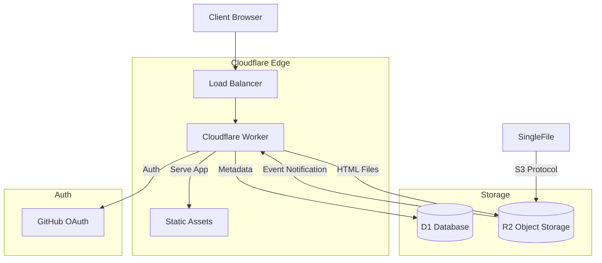

# SingleFile Share 技术设计文档 v1.0

## 1. 系统架构 (System Architecture)

采用全栈 Cloudflare 架构，前端无构建，后端使用 Worker。



## 2. 数据库设计 (Database Design)

### Schema (SQLite/D1)

```sql
-- Users Table
CREATE TABLE users (
    id INTEGER PRIMARY KEY AUTOINCREMENT,
    github_id TEXT UNIQUE NOT NULL,
    username TEXT NOT NULL,
    avatar_url TEXT,
    role TEXT DEFAULT 'user', -- 'admin' | 'user'
    status TEXT DEFAULT 'pending', -- 'pending' | 'active' | 'locked'
    storage_limit INTEGER DEFAULT 104857600, -- 100MB
    used_storage INTEGER DEFAULT 0,
    created_at DATETIME DEFAULT CURRENT_TIMESTAMP
);

-- Files Table
CREATE TABLE files (
    id INTEGER PRIMARY KEY AUTOINCREMENT,
    user_id INTEGER NOT NULL,
    filename TEXT NOT NULL,      -- 原始文件名
    display_name TEXT NOT NULL,  -- 展示名 (默认为 <title>)
    size INTEGER NOT NULL,
    r2_key TEXT NOT NULL,        -- R2 中的存储 Key
    mime_type TEXT DEFAULT 'text/html',
    created_at DATETIME DEFAULT CURRENT_TIMESTAMP,
    updated_at DATETIME DEFAULT CURRENT_TIMESTAMP,
    FOREIGN KEY (user_id) REFERENCES users(id) ON DELETE CASCADE
);

-- Shares Table
CREATE TABLE shares (
    id INTEGER PRIMARY KEY AUTOINCREMENT,
    file_id INTEGER UNIQUE NOT NULL,
    share_id TEXT UNIQUE NOT NULL, -- UUID，对外暴露
    is_enabled BOOLEAN DEFAULT 0,
    visit_count INTEGER DEFAULT 0,
    created_at DATETIME DEFAULT CURRENT_TIMESTAMP,
    FOREIGN KEY (file_id) REFERENCES files(id) ON DELETE CASCADE
);
```

## 3. 存储设计 (R2)

- **Bucket**: `singlefile-share-files`
- **Access Control**: **Private** (Public Access Disabled).
- **Key 策略**: `files/{user_id}/{filename}.html`
- **Root Key Handling**: 
    - 监控根目录上传 (e.g., `my-page.html`)。
    - 自动迁移 (Move) 至主管理员目录: `files/{admin_id}/{uuid}.html`。
    - 确保所有持久化文件均符合 `files/{user_id}/` 格式。

### Metadata Sync Flow (Event Driven)
1. **Upload**: SingleFile -> R2 (`putObject`)
2. **Trigger**: R2 -> Worker (`event`)
3. **Process**:
    - **Check**: Is it a root file?
        - **Yes**: Find First Admin -> `put` to admin dir -> `delete` original -> `ack` (Triggers new event).
        - **No**: Proceed.
    - **Parse**: Extract `user_id` from Key (`files/{user_id}/...`).
    - **Create**: 
        - Generate `share_id`.
        - Read file header for `<title>`.
        - Insert into D1 `files` table.

## 4. API 接口设计

| Method | Endpoint | Description |
| :--- | :--- | :--- |
| **Auth** | | |
| GET | `/auth/login` | GitHub 登录跳转 |
| GET | `/auth/callback` | OAuth 回调 |
| GET | `/auth/me` | 当前用户信息 |
| POST | `/auth/logout` | 登出 |
| **Admin** | | |
| GET | `/api/admin/users` | 用户列表 (分页/筛选) |
| PATCH | `/api/admin/users/:id/status` | 修改状态 (Approve/Lock) |
| PATCH | `/api/admin/users/:id/quota` | 修改配额 |
| **Files** | | |
| GET | `/api/files` | 文件列表 |
| POST | `/api/files` | 上传文件 (Web Dashboard, Multipart) |
| DELETE | `/api/files/:id` | 删除文件 |
| PATCH | `/api/files/:id` | 重命名 |
| **Shares** | | |
| POST | `/api/files/:id/share` | 切换分享状态 |
| GET | `/api/s/:share_id` | 获取分享元数据 |
| GET | `/raw/:share_id` | 获取原始 HTML 内容 (用于 iframe 或直接查看) |

## 5. 前端设计 (No-Build)

### 目录结构
```text
/
├── src/            # Backend (Worker)
├── public/         # Frontend (Static)
│   ├── css/
│   │   ├── reset.css
│   │   └── theme.css  <-- 直接复用 svgshare 样式
│   ├── js/
│   │   ├── dashboard.js
│   │   ├── admin.js    <-- [NEW] 管理员后台逻辑
│   │   ├── share.js
│   │   └── utils.js
│   ├── index.html
│   ├── dashboard.html
│   ├── admin.html      <-- [NEW] 管理员后台页面
│   └── share.html
```

### 关键组件
- **Dashboard**: 使用 Bento Grid 布局展示文件卡片。
- **Viewer**: 使用 `<iframe>` 沙箱隔离预览上传的 HTML 文件，防止 XSS 攻击主站。
  - `<iframe sandbox="allow-scripts allow-same-origin">`

## 6. 样式设计 (Style Extraction)

直接复用 `svgshare` 的 `theme.css`，保持视觉一致性：
- **Background**: `#0a0a0a`
- **Accent**: `#FF3300`
- **Typography**: Inter, JetBrains Mono
- **Visuals**: Noise Overlay, Scanlines

## 7. 安全考虑
## 7. 安全考虑
- **存储安全**:
    - R2 Bucket 必须设置为 **私有 (Private)**。
    - 所有文件下载/查看流量必须经过 Worker。
    - Worker 必须校验 `shares` 表中 `share_id` 的有效性以及 `is_enabled` 状态。
- **内容安全 (CSP)**:
    - `/raw/:share_id`:
        - 强制响应头 `Content-Security-Policy: sandbox allow-scripts allow-same-origin; default-src 'self'; style-src 'unsafe-inline'`.
        - 建议使用 `X-Content-Type-Options: nosniff`。
        - 考虑使用 `Content-Disposition: inline` 但结合 sandbox。
- **隔离建议**:
    - 强烈建议 `raw` 内容使用独立子域名 (e.g. `usercontent.example.com`) 以防止主域 Cookie 泄露风险 (Same-Origin Policy)。但在本项目 MVP 阶段，将严格依赖 CSP Sandbox。
